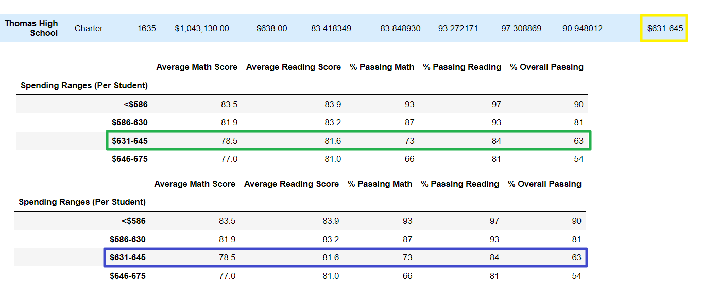

# Updating School District Statistics using Panda
## Overview of Project
### Purpose
 Following the completion of analyzing data for fifteen schools, the district’s school board was notified of possible academic dishonesty by the ninth-grade class at Thomas High School. In order to uphold state testing standards, the ninth-grade scores needed to be updated. By using Pandas’ NumPy module I was able to change the ninth-grade scores to Nan and then update the analysis. By removing the compromised scores from Thomas High School, the school board will be able to visualize and measure the weight the academic dishonesty impacts the original statistics. 
 
## Results and Analysis
### District Summary
I was able to use the Pandas loc method to access specific data I needed to provide the stats and make the appropriate updates. 
Comparing the summary of the original data to the updated data scrubbed of the ninth graders scores, I came to the following conclusions. 

- The number of students did not change since the scores are the only variables that has changed in the data. Meaning, data pertaining to the number of students should not be affected. 
- The removal of the ninth-grade scores drops the total district statistics less than half a percent. 
- At first glance, the formatted data that includes only two decimal places does not seem to show a vast difference after the scores were replaced with Nan. 
- There is one field (Average Reading Score) that does not appear to change at all. 
- Removing the formatting allowed me to better visualize and compare the original statistics to the updated due to more decimal places being available.

### School Summary
 Unlike the District Summary, the School Summary has the information broken down my school which allows statistics of Thomas High School specifically to be analyzed. This allows the effects of the scrubbing of the ninth grader scores to be more evident. 
-I originally believed that with the Nan data in place, that the averages for both would decrease from the removed scores. 
- Regarding the percentage of passing grades for both math and reading there was a slight decline for both. 
- While math did decline as expected, the average reading score increased. 
- The Overall Percentage of passing rate decreased slightly. 
- None of the statistics dropped a whole percentage. 

### Thomas High School
 When comparing the top five and the bottom five schools based on the overall passing percentage – the difference between the original data and the data with the scores replaced with Nan is unnoticeable. 

#### Top Five Schools
-	Thomas High School was originally in the 2nd position of the top five schools. After the data updated, Thomas High remained in this position. 

#### Bottom Five Schools
-	The bottom five schools also remained the same with no changes to the order listed. 

### Replacing the Scores 
 To get more in depth of the impact of the scores replaced with Nan I was able to compare and examine the following tables. 
#### Math and Reading by Grade
The only difference in the original data and the updated data in these tables are the ninth-grade scores for both being replaced with “Nan”.

#### Scores by School Spending
 Thomas High School was the only school with data that changes, any changes would be noticeable in the $631-645 range. Despite the grades being replaced to Nan, no significant change was visible in these stats.

#### Scores by Size
 Thomas High School was the only school with data that changes, any changes would be noticeable in the Medium School Size category. Despite the grades being replaced by Nan, no notable change was visible in these stats. 

#### Scores by School Type
 Since Thomas High School was the only school with data that changes, any changes would be noticeable in the Charter category. Despite the ninth-grade scores replaced to Nan, no change was noticeable in these stats. 

## Summary
 Originally, I expected that taking out a whole grade level worth of scores would decrease the stats, I am surprised as how minimal impact it has had on the statistics. The only notable of those changes being in the District and Per School Summaries.
For the District Summary, none of the fields changed dramatically one Nan replaced the ninth-grade scores for Thomas High School. This seems appropriate when considering the size of the district and the small percentage those students represented in the whole district. Keeping that in mind, I did not expect to see much of a difference but there were a few notable changes. 
-	The highest difference being the percentage of those passing reading which declined 0.3%
-	The lowest difference in data being a decline of 0.02% for the Average Reading Score. 

 Reviewing the Per School Summary is where the data replaced makes a much more notable difference because it allows me to analyze Thomas High School specifically. 
-	While the average for math did decline and was the lowest difference at -.07%, the average reading score increased. This means that there are higher reading scores in other grade levels that increased the average amount for the school and improved their average. 
-	The highest difference in the data was the -0.32% difference seen in the overall percentage of those passing
In conclusion, the data was updated efficiently as required, and the effect of this change to the data provided to the school board was minimal. If the students themselves were removed from the data for any reason, then there would have been more noticeable change to the data, specifically the tables involving spending per student and the size of the school. 
